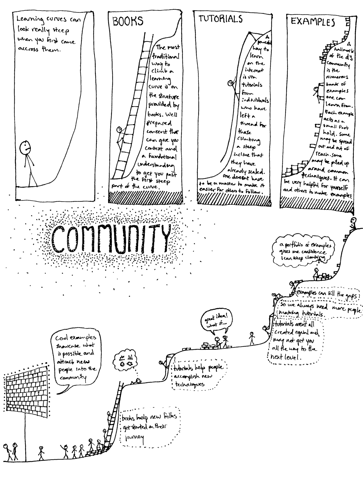
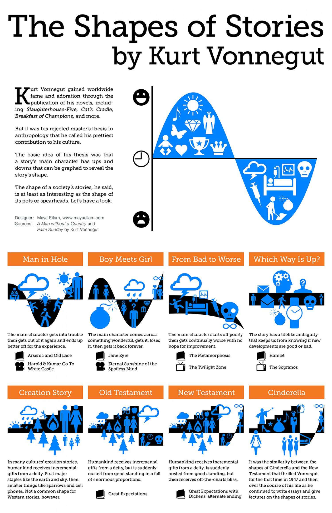

# Leveling up your Visualization and Storytelling Skills

Welcome to the repo of the workshop „Leveling up your Visualization and Storytelling Skills“.

In order to sell your great, groundbreaking ideas as a data scientist in order to get the buy-in of decision makers, one must learn to _communicate_ ideas (and hopefully results!). However, many data scientists do have a strong academic background and focus on their _hard skills_ such as building and evaluation machine learning models, optimization, statistics, coding, ...

I do think that most of you will having the largest ROI in spending some time in improving the soft areas (_in fact I suffered through many poor presentations and unfortunately ugly visualizations_). Therefore the goal here is to teach you basic methods and knowledge in both the visualization department as well as storytelling.

You are also guided to additional resources for further study, but note that at the end of the day you must apply the skills.

  

Probably the likes of Confucius or Albert Einstein would say the road to mastery is long. This is supposed to part of it: produced by the community for the community.

This workshop was done on free time – without pay – and can be seen as community service. This is something you can also do: why don't you share what you have learned by presenting on a [PyData conference](https://www.pydata.org)? Do not hesitate as everyone got at least a unique perspective to share.

__Word of warning__: There is a large design component in visualisation and it can be considered an art – just like storytelling – thus, very probably, you may disagree on aesthetics and taste. It is okay and expected. More importantly, you will at least get technical knowledge out of this talk and some insights on what makes a good presentation.

## Storytelling

  

## Sources

1. The Python Visualization Landscape. Jake VanderPlas. PyCon 2017. [[video]](https://www.youtube.com/watch?v=FytuB8nFHPQ
**A good overview about the visualization libraries of Python in 2017.**

2. :star: Storytelling with Data. Cole Nussbaumer Knaflic. Wiley. [[book]](https://www.amazon.com/gp/product/1119002257) [[page]](https://www.storyingtellingwithdata.com) [[talk]](https://www.youtube.com/watch?v=8EMW7io4rSI)
**I built this workshop around this book.**

3. Presentation Zen. [[blog]](https://presentationzen.blogs.com)
**The reference to Zen describes his minimalistic style well. Also has decent books.**

4. "Data is beautiful" subreddit. [[link]](https://www.reddit.com/r/dataisbeautiful/comments/8viwek/oc_world_income_mountains_19502015_animated/)

5. A visual introduction to Machine Learning. [[link]](www.r2d3.us/visual-intro-to-machine-learning-part-1/)

6. [[distill.pub]](https://distill.pub)
**You find plenty of interesting great visual explanations here (and good writing!) – for the educational / sciency people.**

7. [[pudding.cool]](https://pudding.cool/)

8. Nicky Case, [[site]](https://ncase.me/)
**Interesting way of using animations and interactions to explain topics.**

9. :star: Resonate. Nancy Duarte. [[online book]](http://resonate.duarte.com/#!page0)
**You also find many interesting points of giving talks and storytelling on duarte.com**

10. The Hitchhiker’s Guide to d3.js. Ian Johnson. [[medium post]](https://medium.com/@enjalot/the-hitchhikers-guide-to-d3-js-a8552174733a)

11. Mike Bostock. [[personal site]](https://bost.ocks.org/mike/)
